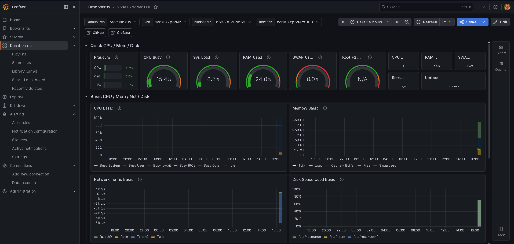
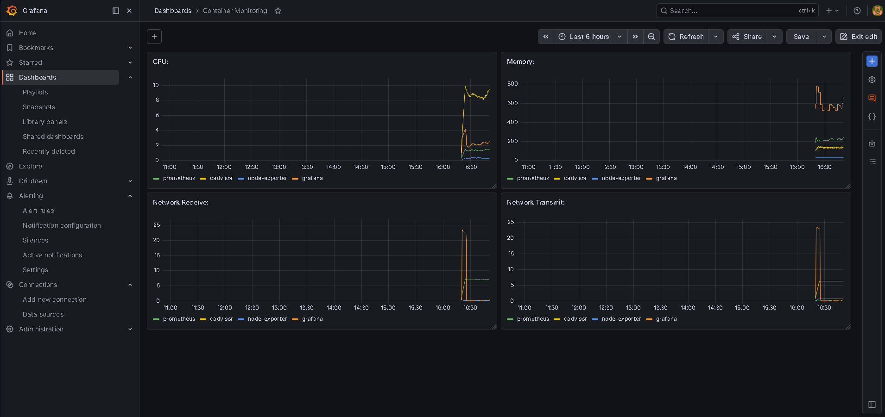
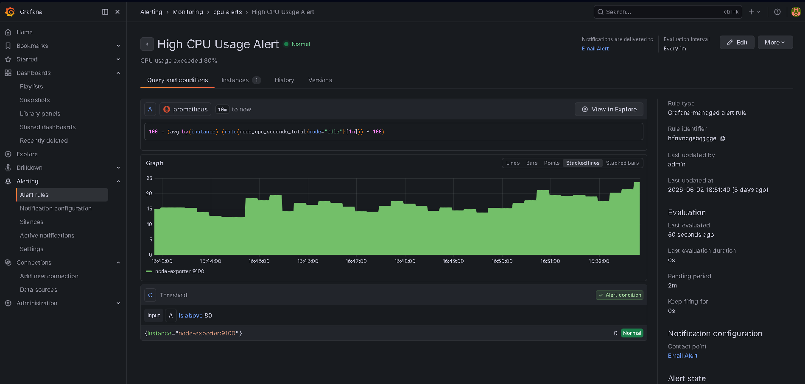
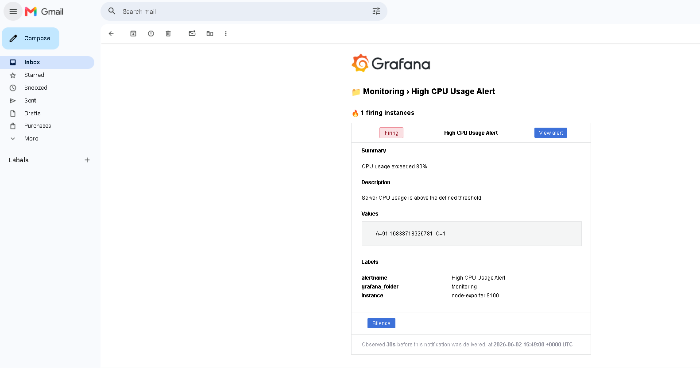

# Docker Monitoring Stack


## Overview

This project demonstrates a complete monitoring solution deployed on an Ubuntu Server virtual machine running in VirtualBox.

The monitoring environment was built using Docker Compose and includes Prometheus, Grafana, Node Exporter and cAdvisor. Grafana was configured with SMTP integration to send email notifications whenever CPU usage exceeds predefined thresholds.

## Environment

* VirtualBox
* Ubuntu Server
* Docker
* Docker Compose

The entire monitoring stack was installed, configured and tested inside an Ubuntu virtual machine.

## Architecture

```text
Node Exporter ──► Prometheus ──► Grafana ──► Email Alerts

cAdvisor ───────► Prometheus ──► Grafana ──► Email Alerts
```

## Features

* Real-time system monitoring
* CPU usage monitoring
* Docker container monitoring
* Email alert notifications
* Persistent Grafana storage
* Custom alert rules
* SMTP integration with Gmail

## Technologies Used

* Linux (Ubuntu Server)
* VirtualBox
* Docker
* Docker Compose
* Prometheus
* Grafana
* Node Exporter
* cAdvisor
* Gmail SMTP

## Services

| Service       | Port |
| ------------- | ---- |
| Grafana       | 3000 |
| Prometheus    | 9090 |
| Node Exporter | 9100 |
| cAdvisor      | 8080 |

## Project Structure

```text
docker-monitoring-stack
│
├── docker-compose.yml
├── prometheus.yml
├── grafana-data
└── README.md
```

## Run Project

```bash
docker compose up -d
```

## Access Services

### Grafana

```text
http://localhost:3000
```

### Prometheus

```text
http://localhost:9090
```

### cAdvisor

```text
http://localhost:8080
```

### Node Exporter

```text
http://localhost:9100/metrics
```

## Alert Example

### High CPU Usage Alert

PromQL Query:

```promql
100 - (avg by(instance) (rate(node_cpu_seconds_total{mode="idle"}[1m])) * 100)
```

Threshold:

```text
CPU Usage > 80%
```

When CPU usage exceeds the threshold, Grafana automatically sends an email notification. Once CPU usage returns to normal levels, a resolved notification email is sent.

## Learning Outcomes

During this project I gained hands-on experience with:

* Linux server administration
* Docker container management
* Monitoring and observability
* Prometheus metrics collection
* Grafana dashboard creation
* Alert rule configuration
* SMTP email integration
* Infrastructure troubleshooting

## Grafana Monitoring Dashboard



Real-time monitoring dashboard built with Grafana and Prometheus.

The dashboard visualizes critical Ubuntu Server metrics including:

- CPU Usage
- Memory Usage
- Disk Usage
- Network Traffic
- System Load
- Uptime

---

## Container Monitoring Dashboard



Container-level monitoring dashboard powered by cAdvisor and Grafana.

The dashboard tracks resource consumption of running Docker containers including:

- CPU Usage
- Memory Usage
- Network Receive
- Network Transmit

---

## Alerting System



A Grafana-managed alert rule was configured to monitor CPU utilization collected from Prometheus.

Alert configuration:

- Metric Source: Prometheus
- Threshold: CPU Usage > 80%
- Evaluation Interval: 1 Minute
- Notification Channel: Email (SMTP)

When the CPU usage exceeds the configured threshold, Grafana automatically triggers an alert and sends an email notification.

---

## Email Notification



Grafana was configured with SMTP email notifications.

When CPU usage exceeds the configured threshold, Grafana automatically sends an email alert containing:

- Alert status
- Metric values
- Alert labels
- Triggered threshold
- Direct link to the alert

This allows administrators to react quickly to system issues without constantly monitoring the dashboard.

## Author

**Furkan SIRDAŞ**
